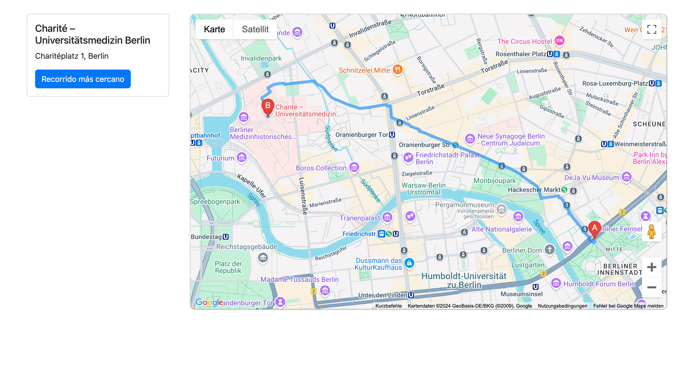

# INSTRUCCIONES

## NECESITAS TU PROPIA API KEY DE GOOGLE MAPS

### HTML
1_IMPORTAR BOOSTRAP Y LA API DE GOOGLE MAPS CON LA LIBRERIA DE BÚSQUEDA DE ESPACIOS (PONER TU PROPIA API KEY DE GOOGLE MAPS)

2_DENTRO DE UNA FILA DE BOOSTRAP:
* CREAR UNA COLUMNA PARA LA INFORMACIÓN DEL HOSPITAL MÁS CERCANO (CON UN BOTÓN PARA DEFINIR LA RUTA ENTRE MI LOCALIZACIÓN Y DICHO HOSPITAL)
* CREAR UN COLUMNA PARA MOSTRAR EL MAPA DE GOOGLE MAPS EN MI LOCALIZACIÓN

### CSS
1_DEFINIR LA ALTURA DEL MAPA DE GOOGLE MAPS

### JS
1_DEFINIR FUNCIÓN `INIT MAP` (QUE ES LA QUE SE LLAMA DESDE EL DOM PARA CARGAR EL MAPA DE GOOGLE MAPS)

2_CREAR UN EVENTO DE EJECUCIÓN DESPUÉS DE CARGAR EL DOM `DOMContentLoaded` COMO UNA FUNCIÓN ASÍNCRONA (NO BLOQUEANTE) YA QUE VA A CONTENER PROMESAS Y QUEREMOS USAR 'AWAIT'

3_CREAR UNA FUNCIÓN PARA OBTENER A TRAVÉS DE LA API DE GEOCALIZACIÓN `navigator.geolocation.getCurrentPosition`, PARA OBTENER NUESTRA LOCALIZACIÓN (TENER EN CUENTA QUE EL USUARIO DEBE DE PERMITIR HABILITAR SU LOCALIDACIÓN DEL NAVEGADOR POR LO TANTO TENEMOS QUE CONFIAR QUE LO VA HACER Y PARA ESO USAMOS UNA PROMESA, LA QUE DEVUELVE EL VALOR DE LA LOCALIZACIÓN DEL USUARIO)

4_DENTRO DEL EVENTO `DOMContentLoaded` CARGAMOS LA FUNCIÓN DE NUESTRA LOCALIZACIÓN (CON UN `AWAIT` PARA ESPERAR LA PROMESA) Y CARGAMOS EL MAPA PERO CON UNA LOCALIZACIÓN ESTÁNDAR ALEATORIA. (TENER EN CUENTA QUE ANTES DE CARGAR EL MAPA TENEMOS QUE ESTAR SEGURO DE QUE SE HA CARGADO LA LIBRERÍA DE GOOGLE MAPS QUE VA POR UN LADO DIFERENTE A EL DOM POR ELLO TENEMOS QUE CREAR UNA VARIABLE QUE NOS SIRVA PARA OTRA PROMESA PARA CONFIAR QUE CUANDO SE CARGUE LA LIBRERÍA DE GOOGLE MAPS YA SE PUEDA CARGUE EL MAPA)

5_CREAMOS UNA PROMESA Y UNA VARIABLE QUE LE PASAMOS COMO RESPUESTA DE ESTA PROMESA Y QUE LUEGO SE METERA DENTRO DE LA FUNCIÓN `INIT MAP` PARA QUE INICIE EL MAPA UNA VEZ RESUELVA A LA PROMESA

6_DENTRO DEL EVENTO `DOMContentLoaded` AL PRINCIPIO PONEMOS CON UN `AWAIT` QUE HASTA QUE NO SE RESUELVAN LAS DOS PROMESAS CREADAS HASTA EL MOMENTO `googleMapsPromise` (QUE CARGE LA API DE GOOGLE MAPS) y `getUsuarioPosicion` (QUE SE PERMITA LA API DE GEOCALIZACIÓN) NO SE AVANZARA EN DICHO EVENTO. DE ESTA MANERA NOS ESTAMOS ASEGURANDO DE QUE:
* EL DOM ESTE CARGADO PARA LLAMAR AL HTML DENTRO DEL JS (EVENTO `DOMContentLoaded`)
* LA API DE GOOGLE MAP ESTE CARGADA PARA MOSTRAR EL MAPA (PROMESA)
* LA GEOCALIZACIÓN ESTE ACTIVA PARA PEDIR LA POSICIÓN DEL USUARIO (PROMESA)

7_DENTRO DEL EVENTO `DOMContentLoaded` DESPUÉS DE ESPERAR LAS RESPUESTAS DE LAS PROMESA Y MOSTRAR EL MAPA DE FORMA ESTÁTICO SE OBTENDRA EN UNA VARIABLE LA LOCALIZACIÓN DEL USUARIO Y HACEMOS QUE EL MAPA SE SITUE EN LA POSICIÓN DE DICHO USUARIO `.panTo`

8_CREAR UNA FUNCIÓN QUE MUESTRE EL HOSPITAL MÁS CERCANO A NUESTRA LOCALIZACIÓN A LA CUAL DEBEMOS PASAR EL MAPA Y NUESTRA LOCALIZACIÓN (NECESITAMOS QUE ESTE CARGADA LA LIBRERIA DE 'PLACES SERVICE' POR LO TANTO DEBE DE SER OTRA PROMESA PARA QUE NOS PROMETA QUE CUANDO HAGAMOS LA LLAMADA YA SE HALLA CARGADO DICHA LIBRERÍA)

9_DENTRO DEL EVENTO `DOMContentLoaded` LLAMAMOS A LA FUNCIÓN CON LA PROMESA DE QUE SE CARGUE ANTES LA LIBRERIA (CON UN `AWAIT`) Y OBTENEMOS LA LOCALIZACIÓN DEL HOSPITAL MAS CERCANO A NUESTRA LOCALIZACIÓN

10_DENTRO DEL EVENTO `DOMContentLoaded` LE DAMOS LOS VALORES AL DOM DEL NOMBRE Y LA DIRECCIÓN DEL HOSPITAL MAS CERCANO

11_DENTRO DEL EVENTO `DOMContentLoaded` CREAMOS UN EVENTO PARA EL BOTON QUE NOS MUESTRE LA RUTA MAS CERCANA ENTRE LA UBICACIÓN NUESTRA (DEL USUARIO) Y LA DEL HOSPITAL MÁS CERCANO (VAMOS A TENER QUE USAR LA LIBRERIA DE DIRECTIONS SERVICES Y DIRECTIONS RENDERER)

### PANTALLA PRINCIPAL

  

### RUTA MÁS CERCANA

  

